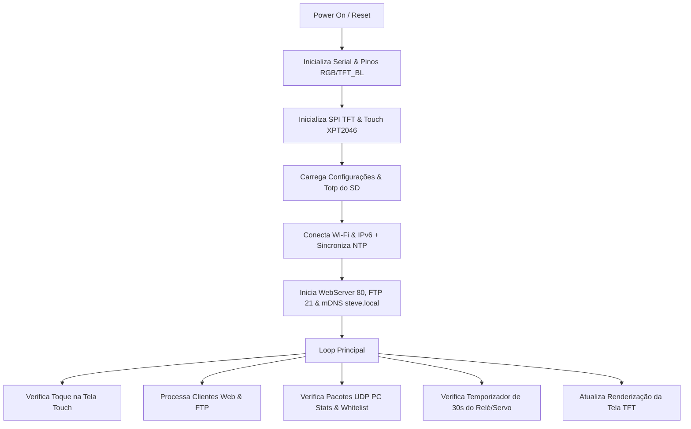

# 📖 Manual Técnico Completo - 2FATouch.ino (Creeper Auth v7.2.2)

---

## 1. Visão Geral do Projeto
O **Creeper Auth v7.2.2** é um sistema embarcado multifuncional desenvolvido para **ESP32** (especialmente placas com display integrados como ESP32-CYD / Cheap Yellow Display). Ele combina **autenticação de dois fatores (2FA / TOTP)**, **cofre de frases sementes de criptomoedas**, **monitoramento de hardware de PC via UDP**, **estação meteorológica**, **gerador de QR Codes (Wi-Fi, PIX, Wise)** e **servidor web/FTP embarcado para gerenciamento de arquivos no SD**, além de integrar controle de relé e servo motor em resposta a eventos (ex: validação YubiKey).

---

## 2. Especificação de Hardware & Mapeamento de Pinos

| Componente / Função | Pino ESP32 | Observações / Descrição |
| :--- | :--- | :--- |
| **TFT Display CS / SPI** | Múltiplos | Controlado pela biblioteca `TFT_eSPI` |
| **Cartão SD CS (SPI)** | `GPIO 5` | Barramento SPI padrão (MOSI: 23, MISO: 19, CLK: 18) |
| **Touchscreen CS (XPT2046)** | `GPIO 33` | SPI dedicado (`HSPI`) |
| **Touchscreen IRQ** | `GPIO 36` | Interrupção por toque na tela |
| **Touchscreen MOSI** | `GPIO 32` | Barramento HSPI |
| **Touchscreen MISO** | `GPIO 39` | Barramento HSPI |
| **Touchscreen CLK** | `GPIO 25` | Barramento HSPI |
| **Relé da Luz / Abajur** | `GPIO 22` | Saída digital para acionar relé (lâmpada) |
| **Servo Motor (Creeper)** | `GPIO 27` | Saída PWM 50Hz (movimenta a cabeça do Creeper 0º a 90º) |
| **LED RGB - Vermelho** | `GPIO 4` | Saída digital (Lógica invertida/HIGH = Desligado) |
| **LED RGB - Verde** | `GPIO 16` | Saída digital |
| **LED RGB - Azul** | `GPIO 17` | Saída digital |
| **TFT Backlight (Brilho)** | `TFT_BL` | Saída digital para controle de ligar/desligar tela |

---

## 3. Dependências e Bibliotecas
Para compilar o `2FATouch.ino`, são necessárias as seguintes bibliotecas no ecossistema Arduino IDE / PlatformIO:

- **`TFT_eSPI`**: Manipulação do display gráfico TFT.
- **`XPT2046_Touchscreen`**: Leitura do painel touch touch via SPI.
- **`TJpg_Decoder`**: Decodificação de imagens JPEG armazenadas no SD.
- **`qrcode.h` / `qrcode.c`**: Geração dinâmica de QR Codes no visor.
- **`ArduinoJson`**: Parsing de dados JSON (APIs de clima).
- **`ESP32FtpServer`**: Servidor FTP para gerenciar arquivos no cartão SD.
- **`ESP32Servo`**: Controle de pulso de servo motores PWM no ESP32.
- **`NTPClient`**: Sincronização de horário de rede (pool.ntp.org) via UDP.
- **`mbedtls/md.h` & `mbedtls/base64.h`**: Cálculo de Hash SHA-256, HMAC-SHA1 para TOTP e decodificação Base64.
- **`WiFi`, `WebServer`, `HTTPClient`, `WiFiClientSecure`, `ESPmDNS`**: Comunicação de rede, servidor HTTP e suporte mDNS.

---

## 4. Estrutura de Arquivos no Cartão SD

O cartão SD armazena as configurações, dados de autenticação e páginas web:

- `/config.txt`: Configurações principais do sistema:
  - `SSID`: Nome da rede Wi-Fi.
  - `PASS`: Senha da rede Wi-Fi.
  - `MODO`: `REDE` (validação por prefixo IP) ou `UNICO`.
  - `IP_ALVO`: Prefixo de IP ou IP único para liberação na Whitelist.
  - `PIX`: Chave PIX cadastrada (CPF, e-mail ou chave aleatória).
- `/ListPass.txt`: Contém o hash **SHA-256** da senha de acesso ao WebServer / SD.
- `/totp_secrets.txt`: Lista de contas 2FA cadastradas no formato `Nome=SecretBase32=SenhaOpcional`.
- `/seeds.txt`: Cofre de sementes crypto no formato `Rótulo|Frase 12 Palavras`.
- `/login.html`: Interface web personalizada para login.
- `/list.html` & `/v.html`: Gerenciadores e leitores de arquivos/vídeos web.
- `/minecraft240.jpg`: Imagem de fundo utilizada na tela de aprovação da YubiKey.

---

## 5. Modos de Exibição no Visor (Display Modes)

O visor altera a tela com base nas variáveis `displayMode` e `currentIndex`:

| `displayMode` | Descrição da Tela |
| :---: | :--- |
| **`0`** | **Rosto Creeper / Modos TOTP**: Mostra o rosto do Creeper ou o token TOTP de 6 dígitos de uma conta com barra de tempo restante de 30s. |
| **`1`** | **QR Code Wi-Fi**: Exibe QR Code para conexão instantânea com logo Creeper central. |
| **`2`** | **QR Code PIX**: Exibe QR Code de pagamento PIX com logo do Porco (Minecraft Pig) central. |
| **`3` / `4`** | **Estação Meteorológica**: Temperatura, vento (classificação de brisa a furacão), condição do tempo, estação do ano e fase da lua (com detecção de *Lua de Sangue*). |
| **`5`** | **Monitor PC Performance**: Exibe FPS em tempo real, % de carga da GPU NVIDIA e Temperatura da GPU recebidos via pacotes UDP. |
| **`6`** | **QR Code Wise**: QR Code de pagamento internacional Wise com logo oficial Wise. |
| **`10`** | **Acesso Aprovado (YubiKey)**: Exibe a imagem `/minecraft240.jpg` com notificação "Acesso Liberado! YUBIKEY OK". |

---

## 6. Lógica de Autenticação TOTP (2FA) e Sementes

- **Cálculo TOTP (`calcTOTP`)**:
  - Calcula a época de 30 segundos: `counter = epoch / 30`.
  - Decodifica a chave Secret em Base32 (`base32Decode`).
  - Executa HMAC-SHA1 via MbedTLS e aplica o truncamento dinâmico RFC 6238 para extrair o código de 6 dígitos.
- **Cofre de Seeds (Vault)**:
  - Armazena frases secretas de 12 palavras em `/seeds.txt`.
  - Exibe no visor em formato de grid numerado (6 palavras à esquerda, 6 à direita) acompanhado da ilustração pixel-art *Spider Jockey*.

---

## 7. Servidor Web e Rotas HTTP/API (Porta 80)

### 📌 Painel de Controle e Navegação
- `GET /`: Dashboard principal responsivo em tom Matrix Verde/Preto com opções de controle do visor, atalhos de navegação e rodapé com copyright.
- `GET /manage`: Gerenciador de tokens 2FA (listar, editar, excluir).
- `GET /add` & `POST /reg`: Formulário e salvamento de novos tokens TOTP no SD.
- `GET /edit` & `POST /update`: Edição de tokens TOTP existentes.
- `GET /del`: Exclusão de token TOTP do arquivo `/totp_secrets.txt`.

### 🔐 Segurança, Login e Autenticação
- `GET /login.html` & `POST /doLogin`: Rota de login customizada com validação por Hash SHA-256.
- `GET /logout`: Encerramento de sessão e revogação de credenciais HTTP Basic Auth.

### 🌐 Configurações e Cofre
- `GET /network` & `POST /net_save`: Edição de Wi-Fi, modo de rede, prefixo IP e chave PIX com reinício automático (`ESP.restart()`).
- `GET /vault`, `POST /reg_seed`, `GET /del_seed`, `GET /view_seed`: Gerenciamento e visualização do cofre de sementes crypto.

### 📁 Gerenciador de Arquivos do SD & Mídia
- `GET /list.html` & `GET /v.html`: Interfaces de navegação no cartão SD.
- `GET /json`: Retorna a estrutura de arquivos e diretórios em formato JSON.
- `POST /upload`: Upload de arquivos via formulário multipart para o cartão SD.
- `POST /saveXARQ`: Gravação de conteúdo em arquivos no SD.
- `GET /editXARQ` & `GET /deleteXARQ`: Leitura e exclusão de arquivos.
- `Streaming HTTP Partial Content (HTTP 206)`: Suporte nativo a envio em partes para vídeos `.mp4` usando o cabeçalho `Range`.

### 🎮 Comandos do Visor e Automação
- `GET /select?id=X`: Altera o modo do visor ou seleciona um token TOTP para exibição remota.
- `GET /exibir?modo=X`: Define alternância rápida de modos (WIFI, PIX, CLIMA, WISE).
- `GET /pcstats`: Ativa o modo de monitor de performance do PC.
- `GET /aprovado?senha=X`: Rota de liberação de segurança (ex: script YubiKey Python). Valida a senha recebida e:
  1. Aciona o Relé (`PINO_RELE_LUZ = HIGH`).
  2. Gira o Servo para 90º (abre a cabeça do Creeper).
  3. Altera a tela para o Modo 10 (`Acesso Liberado`).
  4. Mantém ativo por 30 segundos até o fechamento automático.

---

## 8. Serviços de Rede (FTP, mDNS e UDP)

1. **FTP Server**: Porta `21`, usuário `creeper`, senha `k9R7xM2pQ4vL8wT5`. Permite gestão remota do cartão SD sem remover o cartão do ESP32.
2. **mDNS**: Registra o nome local `http://steve.local` na rede local.
3. **Monitor UDP do PC (Porta 5005)**:
   - Recebe pacotes de telemetria no formato `"FPS,GPU,TEMP"`.
   - Atualiza as variáveis `pcFPS`, `pcGPU` e `pcTemp`.
   - Se `pcTemp <= 0`, o sistema automaticamente desliga o backlight para economizar energia.
4. **Whitelist UDP (Porta 1234)**: Recebe atualizações dinâmicas de IPs liberados enviadas por scripts auxiliares no PC (`dynamicWhitelist`).

---

## 9. Automação de Hardware & Toque

- **Touchscreen XPT2046**:
  - Lê o ponto de toque no barramento `HSPI`.
  - Filtra leituras inválidas de pressão (`100 < p.z < 3500`).
  - Aciona o backlight caso a tela esteja desligada e avança para a próxima tela (`proximaTela()`).
- **Fechamento Automático**:
  - No `loop()`, se `hardwareAtivo == true` e passarem 30.000 ms (30s):
    - O relé da luz desliga (`digitalWrite(PINO_RELE_LUZ, LOW)`).
    - O servo retorna para a posição 0º (`servoCreeper.write(0)`).
    - O visor retorna para o modo standby do Creeper (`displayMode = 0`).

---

## 10. Sistema de Segurança e Whitelist ("Mickey")

A função lambda `ehMickey()` realiza 6 verificações consecutivas de autorização antes de permitir acesso a rotas administrativas:
1. Limpa o IP de destino.
2. Checa se o IP está na **Whitelist Dinâmica** recebida via UDP.
3. Checa se o IP está na **Lista Fixa** cadastrada em `/config.txt`.
4. Checa se o IP corresponde ao **Prefixo da Rede** (em modo `REDE`).
5. Permite tráfego **IPv6 Link-Local** (`fe80::`).
6. Se nenhuma regra for correspondida, o acesso é negado (`HTTP 403`).

---

## 11. Resumo do Fluxo de Execução (`setup` e `loop`)

